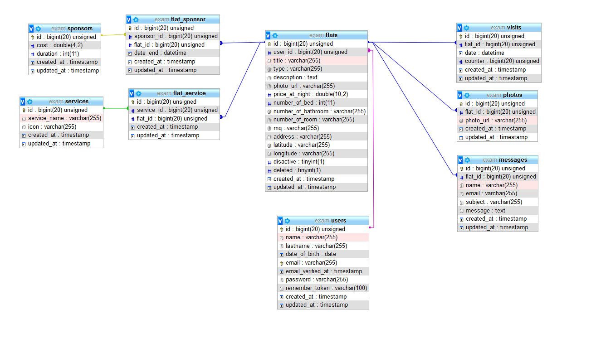

# AirBnb Clone


#####  - Inspired by Airbnb 


****:book: Introduzione: :book:**** 

BoolBnB è una applicazione per trovare e gestire l’affitto di appartamenti.
Attraverso BoolBnB i proprietari di appartamenti possono inserire le informazioni degli
appartamenti che vogliono affittare per cercare utenti interessati.
Gli utenti che vogliono mettere in affitto un appartamento devono registrarsi alla piattaforma;
una volta registrati hanno la possibilità di inserire uno o più appartamenti.
Gli utenti interessati ad un appartamento, utilizzando i filtri di una apposita pagina di ricerca,
vedono una lista di possibili appartamenti e cliccando su ognuno possono vedere una pagina
di dettaglio.
Una volta trovato l’appartamento desiderato, l’utente interessato può contattare l’utente
proprietario per chiedere informazioni.
Inoltre, i proprietari di un appartamento possono decidere di pagare per sponsorizzare
l’annuncio del proprio appartamento per fare in modo che il loro annuncio sia maggiormente
in evidenza rispetto a quelli non sponsorizzati.

--

#  Database Structure



# :arrow_forward: Anteprima Pagine Web:

###  Preview Desktop :desktop_computer: 


###   Preview Mobile :iphone: 


---

# :key: Istruzioni:

### :warning: Crere un nuovo Database con lo stesso nome inserito in DB_DATABASE


### :pencil: Compilare i seguenti campi ne file .env:

> Database Setup 
```sh
1. `DB_CONNECTION`
2. `DB_HOST`
3. `DB_DATABASE`
2. `DB_USERNAME`
3. `DB_PASSWORD`
```

> Braintree (pagamenti)

```sh
1. `BT_MERCHANT_ID`
2. `BT_PUBLIC_KEY`
3. `BT_PRIVATE_KEY`
```

### :white_square_button: Eseguire i seguenti comandi per visionare il progetto:

```sh
* `npm install`
* `php artisan storage:link`
* `npm run watch & php artisan serve`
```


# :computer: Linguaggi e Tecnologie utilizzate:


* HTML


* CSS


* SASS


* Bootstrap


* JS


* jQuery


* Chart Js


* Tomtom (map)


* Algolia (Places/Scout/Autocomplete)


* Braintree


* Ajax


* MySql


* PHP


* Laravel


* Carbon
